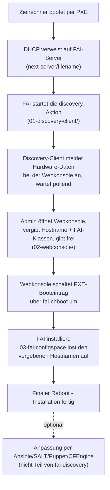

# Architektur

fai-discovery besteht aus vier unabhängigen, aber zusammenspielenden
Komponenten. Kein Bestandteil braucht ein bestimmtes
Konfigurationsmanagement-Tool — fai-discovery endet mit der fertigen
FAI-Installation. Im Anschluss kann mit bekannten Konfigurations-Tools
wie Ansible/SALT/Puppet/CFEngine eine gezielte Anpassung der Installation
erfolgen.

## Ablauf

1. **Zielrechner bootet per PXE.** Der DHCP-Server verweist auf den
   FAI-Server (`next-server`/`filename`-Optionen). Ein DHCP-Server mit
   ISC-dhcpd-kompatiblen PXE-Boot-Optionen (next-server/filename) und
   einen DNS Server für dynamaische Aktualisierung von Hostnamen und IP,
   z.B. Technitium DNS
3. FAI hat keine eingebaute `discovery`-Aktion — sie wird als
   benutzerdefinierter Hook (`01-discovery-client/fai-config/hooks/discovery`)
   ausgeführt. Der Hook sammelt Hardware-Daten (MAC, IP, CPU, RAM,
   Festplattengröße, UEFI/BIOS-Firmware, Seriennummer/UUID) und meldet sie
   per `POST /register` bei der Webkonsole an. Danach pollt er
   `GET /status/<mac>`, bis der Admin freigegeben hat.
4. Der Admin öffnet die Webkonsole (`02-webconsole/`), sieht den
   wartenden Rechner mit seinen Hardware-Daten, vergibt einen Hostnamen
   (mit Vorschlägen aus Typ-/Standort-Präfixen sowie Serial-/UUID-Fragment)
   und wählt FAI-Klassen aus einer konfigurierten Profil-Datei. Freigabe
   löst serverseitig `fai-chboot` aus.
5. `fai-chboot` schaltet den PXE-Booteintrag des Zielrechners auf die
   echte Installation um — inklusive automatischer Erkennung, ob eine
   `_EFI`-Variante der gewählten `disk_config`-Klasse existiert (UEFI vs.
   BIOS/Legacy-Partitionierung).
6. Der Zielrechner bootet erneut, FAI installiert. Während der
   Installation fragt `03-fai-configspace/fai-config/class/02-set-hostname.sh`
   den zuvor vergebenen Hostnamen bei der Webkonsole ab und setzt ihn
   sowohl im laufenden System als auch über FAIs `additional.var`-
   Mechanismus für nachfolgende Skripte.
7. Nach dem finalen Reboot ist die Installation fertig. Ab hier endet
   fai-discovery — im Anschluss kann mit bekannten Konfigurations-Tools
   wie Ansible/SALT/Puppet/CFEngine eine gezielte Anpassung der
   Installation erfolgen (z. B. über eine Lösung, die sich beim ersten
   Boot registriert).
8. `install.sh` (`05-portabilitaet-install/`) automatisiert die
   Einrichtung eines neuen FAI-Servers mit allen Komponenten aus Schritt
   1–6. Wer keine fremden Skripte ausführen möchte, findet die
   äquivalenten manuellen Schritte in
   [`installation-manual.md`](installation-manual.md).

## Wo welche Komponente läuft

| Komponente | Läuft auf |
|---|---|
| `01-discovery-client/fai-config/hooks/discovery` | Im FAI-NFSROOT, ausgeführt vom Zielrechner während des Discovery-Boots |
| `02-webconsole/` | Auf dem FAI-Server (systemd-Service, Flask, Port 8080) |
| `03-fai-configspace/fai-config/class/02-set-hostname.sh` | Im FAI-NFSROOT, ausgeführt vom Zielrechner während der echten Installation |
| `05-portabilitaet-install/../install.sh` | Einmalig auf einem neuen FAI-Server, zur Ersteinrichtung |

## Datenmodell

Die Webkonsole hält den Zustand jedes gemeldeten Geräts (MAC-Adresse als
Schlüssel) in einer SQLite-Datenbank: `waiting` (gemeldet, wartet auf
Freigabe), `reboot` (freigegeben, wartet auf den finalen Reboot),
`discarded` (manuell verworfen). Admin-Accounts liegen getrennt davon in
`/etc/fai-discovery/admins.json` (HTTP-Basic-Auth, siehe
[`installation-webconsole.md`](installation-webconsole.md)).
