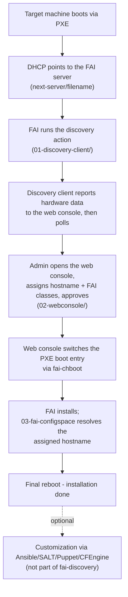

# Architecture

fai-discovery consists of four independent but cooperating components.
None of them requires a particular configuration management tool —
fai-discovery's job ends with the finished FAI installation. From
there, well-known configuration tools such as Ansible/SALT/Puppet/
CFEngine can take over for targeted customization of the installed
system.

## Flow

1. **Target machine boots via PXE.** The DHCP server points it at the
   FAI server (`next-server`/`filename` options). A DHCP server with
   ISC-dhcpd-compatible PXE boot options (next-server/filename) and a
   DNS server for dynamic updates of hostname and IP is required, e.g.
   Technitium DNS.
3. FAI has no built-in `discovery` action — it is implemented as a
   custom hook (`01-discovery-client/fai-config/hooks/discovery`). The
   hook collects hardware data (MAC, IP, CPU, RAM, disk size,
   UEFI/BIOS firmware, serial number/UUID) and reports it via
   `POST /register` to the web console. It then polls
   `GET /status/<mac>` until the admin has approved the device.
4. The admin opens the web console (`02-webconsole/`), sees the
   waiting machine with its hardware data, assigns a hostname (with
   suggestions from type/location prefixes as well as a serial/UUID
   fragment) and picks FAI classes from a configured profile file.
   Approving triggers `fai-chboot` server-side.
5. `fai-chboot` switches the target machine's PXE boot entry to the
   real installation — including automatically detecting whether an
   `_EFI` variant of the chosen `disk_config` class exists (UEFI vs.
   BIOS/legacy partitioning).
6. The target machine reboots and FAI installs. During the
   installation, `03-fai-configspace/fai-config/class/02-set-hostname.sh`
   queries the web console for the previously assigned hostname and
   sets it both in the running system and via FAI's `additional.var`
   mechanism for later scripts.
7. After the final reboot, the installation is done. This is where
   fai-discovery's job ends — from here, well-known configuration
   tools such as Ansible/SALT/Puppet/CFEngine can take over for
   targeted customization of the installation (e.g. via a solution
   that registers itself on first boot).
8. `install.sh` (`05-portabilitaet-install/`) automates setting up a
   new FAI server with all the components from steps 1–6. If you don't
   want to run someone else's script, the equivalent manual steps are
   in [`installation-manual.md`](installation-manual.md).

## Where each component runs

| Component | Runs on |
|---|---|
| `01-discovery-client/fai-config/hooks/discovery` | Inside the FAI NFSROOT, executed by the target machine during the discovery boot |
| `02-webconsole/` | On the FAI server (systemd service, Flask, port 8080) |
| `03-fai-configspace/fai-config/class/02-set-hostname.sh` | Inside the FAI NFSROOT, executed by the target machine during the actual installation |
| `05-portabilitaet-install/../install.sh` | Once on a new FAI server, for the initial setup |

## Data model

The web console keeps the state of every reported device (MAC address
as the key) in a SQLite database: `waiting` (reported, awaiting
approval), `reboot` (approved, awaiting the final reboot), `discarded`
(manually discarded). Admin accounts are kept separately in
`/etc/fai-discovery/admins.json` (HTTP Basic Auth, see
[`installation-webconsole.md`](installation-webconsole.md)).
